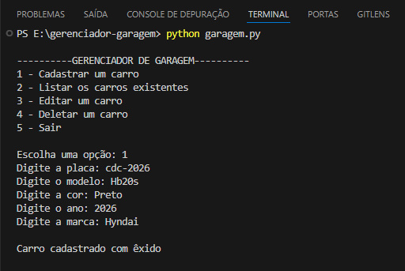
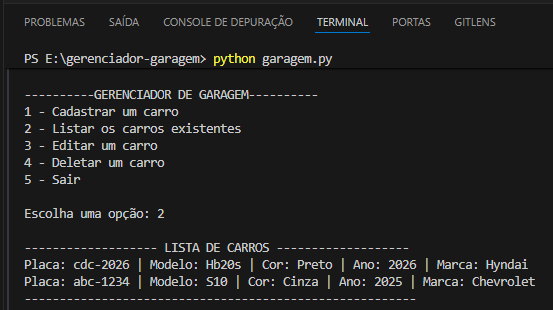

# 🚗 Gerenciador de Garagem (CRUD em Python)

Sistema simples em Python (terminal/console) para gerenciamento de carros, permitindo cadastrar, listar, editar e deletar veículos.

---

## 📸 Demonstração

### Menu

### Cadastro

### Listagem

### Edição

---

## 📌 Funcionalidades

✅ Cadastrar carro  
✅ Listar carros cadastrados  
✅ Editar informações do carro  
✅ Deletar carro  
✅ Busca por placa (case insensitive)  
✅ Validação de campos vazios  
✅ Menu interativo no terminal  

---

## 🧠 Conceitos praticados

- Funções  
- Listas  
- Dicionários  
- CRUD  
- Estruturas condicionais  
- Laços de repetição  
- Validação de dados  
- Organização de código  

---

## 🗂 Estrutura do projeto

gerenciador-garagem/

│

├── garagem.py

├── images/

└── README.md

---

## ▶️ Como executar

### 1️⃣ Ter o Python instalado

python --version

### 2️⃣ Executar o programa

python garagem.py

---

## 📦 Estrutura dos dados

python
carro = {
    "placa": "ABC1234",
    "modelo": "Civic",
    "cor": "Preto",
    "ano": 2020,
    "marca": "Honda"
}

👨‍💻 Autor

Natanael Alves

